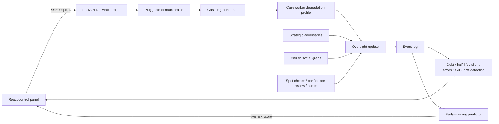

# Driftwatch Architecture

## Oversight-Safety Runtime

The domain oracle supports benefits eligibility, MSME microfinance, rural
healthcare triage, and gig-platform dispatch. The caseworker layer exposes
closed, open-source API, and local FP16/INT8/INT4 conditions. Population runs
use reproducible degradation profiles around oracle ground truth, so they work
without provider credentials; optional live provider adapters remain available
for direct model calls.

Each citizen independently tracks review probability and review skill. Language
mismatch and explanation quality affect effective skill, latency and trust are
logged as separate skip causes, healthcare applies a structural reviewer-capacity
ceiling, and network influence uses observable neighbor complaint rates. The
event log drives both aggregate metrics and the timestep-10 early-warning model.

## Legacy Population Engine

The original tiered Tier 1/2/3 population engine remains available through the
general simulation routes. It is separate from the Driftwatch oversight runtime
and continues to be covered by the existing engine/API test suite.

## Reproducibility and Limits

- Requests accept a seed and bounded population/horizon parameters.
- Simulation profiles are research assumptions, not empirical measurements of
  named production models.
- Prompt-injection rates are deterministic simulated susceptibility probes.
- State, result storage, caching, and rate limits are process-local.
- Multimodal decisions are not modeled.
